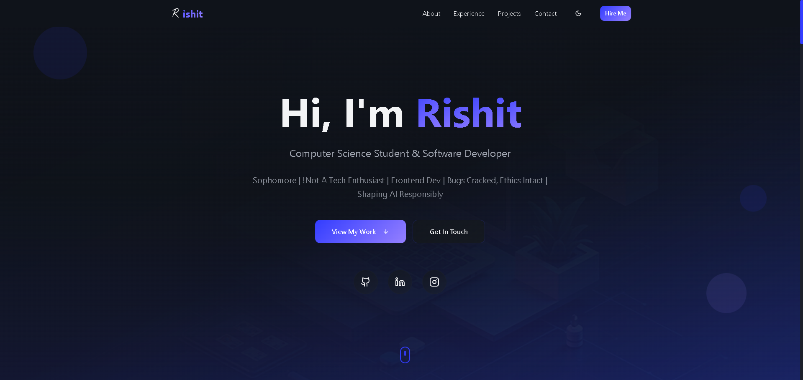

# 🚀 Portfolio Website



## 🌐 Live Demo

**[🔗 View Live Portfolio](https://rishit-exe.github.io/portfolio/)**

> Experience the portfolio in action! Click the link above to explore the live website.

---

A modern, responsive portfolio website built with React, TypeScript, and Tailwind CSS, showcasing my skills, projects, and professional experience.

## ✨ Features

### 🎨 Design & UI
- **Modern Design**: Clean and professional interface with smooth animations
- **Dark/Light Theme**: Toggle between themes with system preference detection
- **Responsive Layout**: Optimized for all device sizes (mobile, tablet, desktop)
- **Interactive Animations**: Custom animations including Galaxy background, Electric Border, and Spotlight cards
- **Glass Morphism**: Modern glass effects and elegant transitions

### 🧭 Navigation & Sections
- **Smooth Navigation**: Single-page application with smooth scrolling between sections
- **Hero Section**: Dynamic introduction with call-to-action buttons
- **About Me**: Personal introduction with skill highlights and resume download
- **Experience**: Certifications, training, and education with interactive elements
- **Projects**: Featured and additional projects showcase (toggleable)
- **Contact**: Functional contact form with Formspree integration

### 🔧 Technical Features
- **TypeScript**: Full type safety and better development experience
- **Component Architecture**: Modular and reusable React components
- **Theme System**: Context-based theme management with localStorage persistence
- **Form Handling**: Integrated contact form with Formspree
- **Bold Text Support**: Markdown-style formatting in achievements and descriptions
- **Certificate Links**: Direct links to verify certifications and credentials

## 🛠️ Tech Stack

### Frontend
- **React 18** - Modern React with hooks and functional components
- **TypeScript** - Type-safe JavaScript development
- **Vite** - Fast build tool and development server
- **Tailwind CSS** - Utility-first CSS framework

### UI Components
- **Radix UI** - Accessible, unstyled UI primitives
- **Lucide React** - Beautiful and consistent icons
- **Custom Components** - Reusable UI components library

### Build & Deploy
- **ESLint** - Code linting and formatting
- **PostCSS** - CSS processing and optimization
- **GitHub Pages** - Automated deployment

## 🚀 Getting Started

### Prerequisites
- Node.js (v18 or higher)
- npm or yarn package manager

### Installation

1. **Clone the repository**
   ```bash
   git clone https://github.com/rishit-exe/portfolio.git
   cd portfolio
   ```

2. **Install dependencies**
   ```bash
   npm install
   # or
   yarn install
   ```

3. **Start development server**
   ```bash
   npm run dev
   # or
   yarn dev
   ```

4. **Open in browser**
   Navigate to `http://localhost:5173`

### Build for Production

```bash
npm run build
# or
yarn build
```

### Deploy to GitHub Pages

```bash
npm run deploy
# or
yarn deploy
```

## 📁 Project Structure

```
portfolio/
├── public/                 # Static assets
│   ├── *.png, *.jpg       # Images and logos
│   ├── favicon.ico        # Site favicon
│   └── robots.txt         # SEO configuration
├── src/
│   ├── animations/        # Custom animation components
│   │   ├── ElectricBorder.tsx
│   │   ├── Galaxy.tsx
│   │   ├── SpotlightCard.tsx
│   │   └── ...
│   ├── components/        # React components
│   │   ├── ui/           # UI component library
│   │   ├── About.tsx     # About section
│   │   ├── Contact.tsx   # Contact form
│   │   ├── Experience.tsx # Experience & education
│   │   ├── Hero.tsx      # Landing section
│   │   ├── Navigation.tsx # Header navigation
│   │   ├── Projects.tsx  # Projects showcase
│   │   └── Footer.tsx    # Footer section
│   ├── contexts/         # React contexts
│   │   └── ThemeContext.tsx # Theme management
│   ├── hooks/            # Custom React hooks
│   ├── lib/              # Utility functions
│   ├── pages/            # Page components
│   └── assets/           # Local assets
├── *.config.js           # Configuration files
└── package.json          # Dependencies and scripts
```

## 🎨 Customization

### Theme Configuration
The theme system supports easy customization through CSS variables in `src/index.css`:

```css
:root {
  --primary: 217 91% 60%;
  --primary-foreground: 0 0% 98%;
  --background: 0 0% 100%;
  /* ... other theme variables */
}

.dark {
  --primary: 217 91% 60%;
  --primary-foreground: 0 0% 98%;
  --background: 224 71% 4%;
  /* ... dark theme variables */
}
```

### Adding Projects
Update the projects array in `src/components/Projects.tsx`:

```typescript
const projects = [
  {
    title: "Your Project Title",
    description: "Project description...",
    image: "project-image.jpg",
    technologies: ["React", "TypeScript", "..."],
    liveUrl: "https://your-project.com",
    githubUrl: "https://github.com/username/repo",
    featured: true, // Set to true for featured projects
    highlights: [
      "Key feature 1",
      "Key feature 2",
      // ...
    ]
  }
  // ... more projects
];
```

### Experience & Education
Update your experience in `src/components/Experience.tsx`:

```typescript
const experiences = [
  {
    title: "Certification Title",
    company: "Provider",
    location: "Location",
    period: "Date Range",
    description: "Description...",
    technologies: ["Tech1", "Tech2"],
    achievements: [
      "**Bold achievement**: Regular text",
      "Achievement with **highlighted** parts"
    ]
  }
];
```

## 🔧 Configuration

### Environment Variables
Create a `.env` file for environment-specific configurations:

```env
VITE_FORMSPREE_ENDPOINT=your_formspree_endpoint_here
```

### Deployment Configuration
The project includes automated deployment scripts:

- `npm run build` - Build for production
- `npm run deploy` - Deploy to GitHub Pages
- `AutoDeploy.bat` - Windows batch script for deployment

## 📱 Responsive Design

The portfolio is fully responsive with breakpoints for:
- **Mobile**: < 768px
- **Tablet**: 768px - 1024px
- **Desktop**: > 1024px

## 🎯 SEO & Performance

- **Semantic HTML**: Proper HTML5 semantic elements
- **Meta Tags**: Configured for social media sharing
- **Performance**: Optimized images and lazy loading
- **Accessibility**: ARIA labels and keyboard navigation support

## 🤝 Contributing

1. Fork the repository
2. Create a feature branch (`git checkout -b feature/amazing-feature`)
3. Commit your changes (`git commit -m 'Add amazing feature'`)
4. Push to the branch (`git push origin feature/amazing-feature`)
5. Open a Pull Request

## 📄 License

This project is licensed under the MIT License - see the [LICENSE](LICENSE) file for details.

## 🙏 Acknowledgments

- **Design Inspiration**: Modern portfolio designs and UI/UX best practices
- **Icons**: [Lucide React](https://lucide.dev/) for beautiful icons
- **UI Components**: [Radix UI](https://www.radix-ui.com/) for accessible components
- **Animations**: Custom CSS and React animations
- **Hosting**: [GitHub Pages](https://pages.github.com/) for free hosting

## 📞 Contact

**Rishit Srivastava**
- Portfolio: https://rishit-exe.github.io/portfolio
- LinkedIn: https://www.linkedin.com/in/the-rishit-srivastava
- Email: rishit.vns05@gmail.com
- GitHub: [@rishit-exe](https://github.com/rishit-exe)

---

⭐ **Star this repository if you found it helpful!**